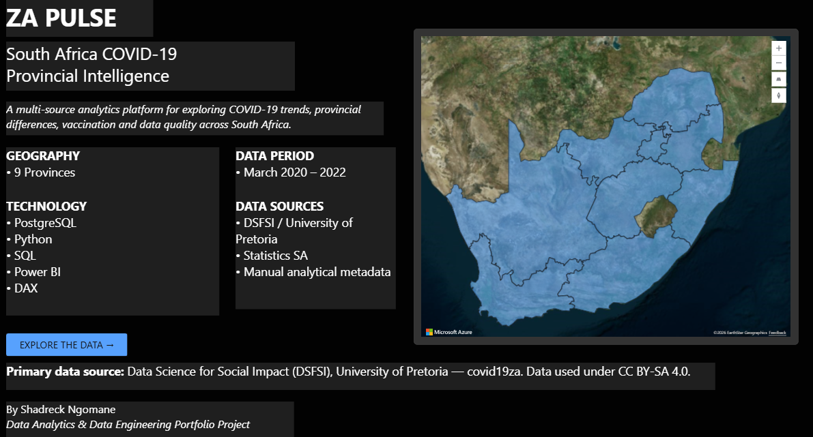

# ZA Pulse — South Africa COVID-19 Provincial Analytics

Portfolio project. Official provincial COVID-19 series for South Africa, landed in PostgreSQL, modelled at province × report date, and reported in Power BI with DAX.

**v1.0** is the report: Cover, Pulse, Provinces, Vaccination, Quality.



## What it answers

- How large was the published national stock on a chosen report date?
- Which province carried the most cumulative burden per 100,000 people?
- Which province was adding cases fastest per capita in the selected window?
- How many doses had been published, and what share of the 2021 population is that?
- Which fact rows were revised or failed a warehouse rule, and were they kept?

Vaccination is **doses, not people**. A province can pass 100% when first and second doses are both in the numerator.

## Grain

- 9 provinces. No South Africa fact row. National is a sum.
- Grain is province × report date.
- Facts only on official report dates, 1 March 2020 – 31 December 2022.
- `UNKNOWN` is a source bucket, not a province. It has no population, so rates stay blank.

## Stack

- PostgreSQL 16, schemas `raw` / `stg` / `core` / `meta`
- Python notebooks for inspection and ingest checks
- Power BI Import model and DAX
- GitHub

PostgreSQL is the warehouse used for this build. MySQL was only a fallback and was not used.

## Data

Primary series: [dsfsi/covid19za](https://github.com/dsfsi/covid19za), Data Science for Social Impact, University of Pretoria, compiled from NICD and Department of Health. Licence CC BY-SA 4.0.

Statistics SA P0302 2021 mid-year estimates are used for population only. They are not a case source.

Wave labels and analyst notes are manual.

## Report

| Page | Question |
|---|---|
| Cover | What this report is, and what it is not |
| Pulse | National stock, pace, and burden per 100,000 |
| Provinces | Who was hit hardest per capita in the selected window |
| Vaccination | Published doses and dose coverage |
| Quality | Flagged rows, kept, with the source catalogue |

Screenshots are in [`docs/Screenshot`](docs/Screenshot). The numeric checks are in [`docs/day-10-validation.md`](docs/day-10-validation.md).

Anchor date used throughout the build: **1 July 2021**.

| Check | National | Gauteng |
|---|---:|---:|
| Confirmed | 1,995,556 | 662,300 |
| New confirmed | 21,583 | 12,806 |
| 7-day average | 16,916.1 | 10,613.0 |
| Active | 179,734 | 94,677 |
| Doses | 3,289,900 | 789,010 |
| Dose coverage | 5.47% | 4.99% |

Quality, full series: 9,909 fact rows, 61 flagged. Flags are warehouse rules (`REV_*`, `NEG_ACTIVE`, `REC_GT_CONF`, `DEATH_GT_CONF`). A flagged row is kept.

## Repo map

```text
notebooks/   inspection and ingest checks
sql/         schemas, dimensions, fact, repairs
docs/        build logs, DAX, validation, screenshots
data/        local inputs that are safe to commit
```

The Power BI file is an Import model on a local PostgreSQL database. Refresh needs that database. The `.pbix` in `docs/` is the report file. It is not a live connection.

## Build log

- Day 1: repository
- Day 2: schemas, dimensions, source registry
- Day 3–4: confirmed, recoveries, deaths, vaccination landed and staged
- Day 5: `core.FactProvincialDaily`, `New*` from the previous report, `DqFlag`
- Day 6: Power BI Import model
- Day 7: DAX measure pack
- Day 8: Pulse and Provinces
- Day 9: Vaccination and Quality
- Day 10: cover, validation, screenshots, `v1.0`
